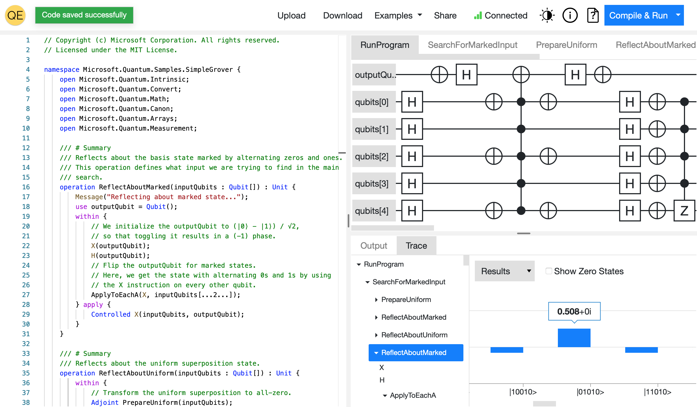

<h1 align="center">
  <br>
  
  <br>
  Quantum Explorer
  <br>
</h1>

<h3 align="center">An interactive, web-based IDE/playground for the <a href="https://docs.microsoft.com/en-us/azure/quantum/">Q#</a> quantum computing language.
</h3>

<p align="center">
Developed by <a href="https://github.com/Adam-Kowalczyk">Adam Kowalczyk</a>, <a href="https://github.com/JakuJ">Jakub Janaszkiewicz</a> and <a href="https://github.com/skdw">Kamil Górzyński</a> as part of a bachelor's thesis at the Faculty of Mathematics and Information Science, Warsaw University of Technology.
</p>

<p align="center">


<a href="https://codecov.io/gh/JakuJ/quantum-explorer">

</a>
</p>

<p align="center">
  <a href="#key-features">Key features</a> •
  <a href="#building">Building</a> •
  <a href="#deployment">Deployment</a>
</p>



# Key features

* Edit Q# code with live language server support
* Compile and simulate your programs locally or in the cloud
* View quantum circuits corresponding to your operations in a graphical composer
* Visualize register state at every point of the simulation
* Share code with other users using a link
* Explore a small built-in library of example quantum algorithms

# Building

To build the app locally, make sure you have the following installed:

- .NET 5 SDK and runtime
- .NET Core 3.1 SDK and runtime
- npm

and use the `dotnet` CLI:

```shell
dotnet run --project Explorer
```

Alternatively, use Docker with the provided `Dockerfile`.

The `docker-compose` file included in this repository allows you to run the containerized version of the app along with the [language server](https://github.com/JakuJ/qsharp-compiler-mirror) and a database.
# Deployment

The production version of the app is meant to be deployed on **Azure**. The development version is running on a free-tier Heroku instance.

## Development

The development version of the app, tracking the `develop` branch is running at https://qexplorer.herokuapp.com. The
deployment happens automatically using a push hook configured in Heroku.

The runtime config involves setting **config vars** as follows:

| Variable | Value |
|---|---|
| ASPNETCORE_ENVIRONMENT | Development |
| LANGUAGE_SERVER_URL | wss://qexplorer-ls.herokuapp.com |

This version of the application executes Q# compilation and simulation on the same server as the app itself. 

**NOTE**: Simulating quantum circuits requires substantial amounts of memory and the free-tier instance is prone to rebooting if too many simulations are scheduled at the same time.

## Production

The production version of the app is meant to be deployed to an Azure Web App for Containers.

**NOTE**: The names for Azure services in the configuration below are such as we had set up during development.

The deployment is performed manually by pushing the Docker container (or rather, its build context, the build is remote)
to Azure Container Repository (ACR). Run the following Azure CLI commands from the root folder of the repository:

```shell 
az acr build --registry QuantumExplorer --image explorer:<tag> --build-arg NODE_ENV=production --verbose .
```

where `<tag>` is the docker image tag for the release (e.g. `latest` or `1.0`).

The runtime config involves setting **application settings** as follows:

| Variable | Value |
|---|---|
| ASPNETCORE_ENVIRONMENT | Production |
| LANGUAGE_SERVER_URL | wss://language-server.azurewebsites.net  |
| FUNCTION_ENDPOINT | https://qs-compiler.azurewebsites.net/api/CompilerFunction |
| FUNCTION_KEY | \<default key from the Azure Function "App keys" panel> |

This version of the application executes Q# compilation and simulation using the Azure Function from
the `Compiler.AzureFunction` project.

In order to access the production endpoint, the `FUNCTION_KEY` environment variable has to be provided. Otherwise,
the `401 Unauthorized` status code is returned.

### Azure Functions app

The Q# compiler module used in production is deployed to Azure Functions. In order to push a new version of the app,
open this repository in VS Code with the Azure Functions extension installed. Rebuild the `Compiler.AzureFunction`
project and deploy from the extension to the `qs-compiler` Azure Functions app.

To test the function locally run the following command in the `Compiler.AzureFunction` directory:

```shell
func host start --port 7071 --pause-on-error --verbose --csharp
```

and set the `FUNCTION_ENDPOINT` environment variable to the link it gives you.
Also, the `ASPNETCORE_ENVIRONMENT` variable has to be set to "Production".

### Database

To set up a local database from migrations you should
have [Entity Framework Core tools](https://docs.microsoft.com/en-us/ef/core/cli/dotnet) installed.

If you want to use MS SQL Server in a Docker container, run:

```shell
docker pull microsoft/mssql-server-linux:2017-latest
docker run -e "ACCEPT_EULA=Y" -e "MSSQL_SA_PASSWORD=YourStrong!Passw0rd" -p 1433:1433 -d microsoft/mssql-server-linux:2017-latest

# or

docker-compose up --build database
```

Then change the `ConnectionString` in `Explorer/appsetting.json` to:
`"Server=127.0.0.1,1433;Database=CodeDatabase;User Id=SA;Password=YourStrong!Passw0rd;"`

Next, from the root folder of the repository, run:

```shell
dotnet ef database update --startup-project Explorer
```
